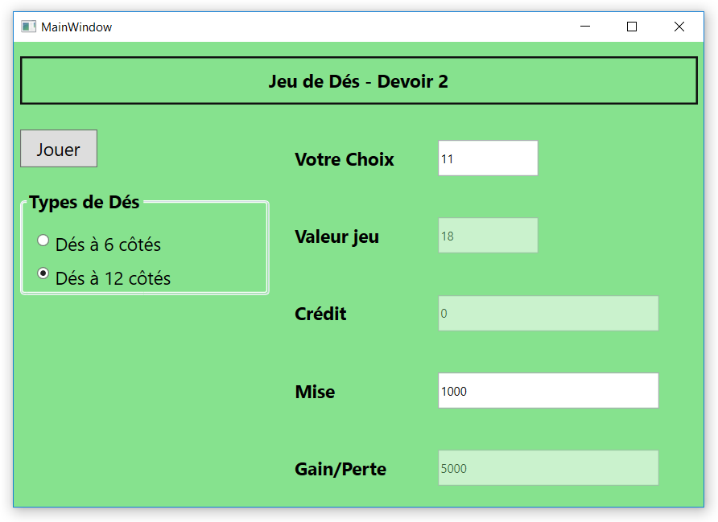

# Background
This is a project that students did in the object-oriented course (Programmation) of the program [Programmeur Web (Web Developer)](http://fc.cegepoutaouais.qc.ca/index.php/programmes-aec/informatique-col-180/programmeur-web) in [Cégep de l'Outaouais](http://www.cegepoutaouais.qc.ca/). The goal is to imitate a dice game. 

# Project Description
As shown in the following screenshot, it is a game of rolling two dices where each has either 6 or 12 sides. From the **Votre Choix (Your choice)** input box, the player guesses the summation of the rolling results of the two dices whose number of faces is selected from the left-side panel **Types de Dés** (dice types). Then he enters the initial credit and bet into the **Crédit (Credit)** and **Mise (Bet)** input boxes before clicking the "Jouer (Play)" button for starting the game. The game ends if the "Crédit (Credit)" reaches negative.

# Requirement
The students are given an interface **IJeuDeDés** with two operations as shown in the UML graph. Except for implementing the interface, they can have the creatiy in the implementation of the rest.

# ScreenShot

# UML

# Design patterns addressed

1. [Template method pattern](https://en.wikipedia.org/wiki/Template_method_pattern)
> In software engineering, the template method pattern is a behavioral design pattern that defines the program skeleton of an algorithm in an operation, deferring some steps to subclasses. It lets one redefine certain steps of an algorithm without changing the algorithm's structure.

2. [Singleton pattern](http://csharpindepth.com/Articles/General/Singleton.aspx)
> Essentially, a singleton is a class which only allows a single instance of itself to be created, and usually gives simple access to that instance. Most commonly, singletons don't allow any parameters to be specified when creating the instance - as otherwise a second request for an instance but with a different parameter could be problematic! (If the same instance should be accessed for all requests with the same parameter, the factory pattern is more appropriate.)

3. [Factory method pattern](http://www.oodesign.com/factory-pattern.html)
> Creates objects without exposing the instantiation logic to the client.
> Refers to the newly created object through a common interface

4. [Extension methods](https://en.wikipedia.org/wiki/Extension_method) --- not a design pattern but sometimes similar to the decorator pattern in the effect
> Next to extension methods allowing code written by others to be extended as described below, extension methods enable patterns that are useful in their own right as well. The predominant reason why extension methods were introduced was Language Integrated Query (LINQ). Compiler support for extension methods allows deep integration of LINQ with old code just the same as with new code, as well as support for query syntax which for the moment is unique to the primary Microsoft .NET languages.

# Methods
1  Template method pattern

I list all this pattern here as I feel that almost all object-oriented apply this pattern whether the programmer is aware of this or not. 

