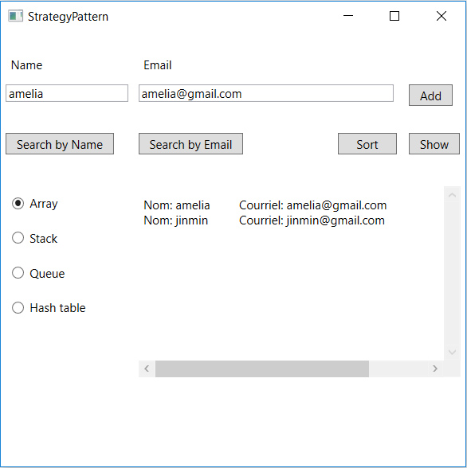

# Requirement
In this toy project, we are asked to use four different structures (Array, stack, queue and hash table) 
to save the name and e-mail address pairs which are expressed by the [C# struct type](https://msdn.microsoft.com/en-us/library/aa288471(v=vs.71).aspx). For each of the structure, we are asked to implement the following functions: 
1. Add the value pairs
2. Search by name
3. Search by e-mail
4. Show all entries
5. Sort the entries by name

For this task, I feel it is natural to use the strategy pattern, and the solution given here has to respect the requirement of the task.

# ScreenShot



# UML


# Outline
1.  The strategy pattern prevents the mass of the code which checks the structrue selected for each function.

 According to the above **Screenshot**, I use a dictionary to save the different concrete structure strategies, where the key corresponds to the radio button name selected and the value corresponds to the instance of the related strategy. A click on any of the structure radio button will trigger the event (see the event handler **radioButton_Click**) which sets the strategy selected according to the radio name. When the **Show** button is clicked, for instance, though we don't know the strategy selected explicitly, it is decided at runtime. 
 
```
        Dictionary<string, AbstractStructureStrategy> instances = new Dictionary<string, AbstractStructureStrategy>() {
            {"arrayRd", new ArrayStrategy() },
            {"stackRd", new StackStrategy() },
            {"queueRd", new QueueStrategy() },
            {"hashRd", new DictionaryStrategy()}
        };
        AbstractStructureStrategy strategy; 
        
        private void radioButton_Click(object sender, RoutedEventArgs e)
        {
            strategy = instances[((RadioButton)sender).Name];
        }   
        
        private void showBtn_Click(object sender, RoutedEventArgs e)
        {
            this.showTB.Text = strategy.ShowAll();
        } 
```
2. 4 structures **ArrayStrategy**, **StackStrategy**, **QueueStrategy** and **DictionaryStrategy** that implement the **AbstractStrategy**.
3. A static helper class **ExtensionMethods** comprising the extension methods that implment the main logic by functioning over the common data type **NameEmail[]**. 
4. A struct type **NameEmail** consisting of **Name** and **Email** properties.

# Method
1. In the **AbstractStrategy** class, the **convertToArray()** method converts the individual contrecte structures (inheritances) to the same data type **NameEmail[]** which is used in the static class **ExtensionMethods** to implement the respective functions. 
```
    abstract public class AbstractStructureStrategy
    {
        abstract public void Add(string name, string email);
        virtual public string Sort()
        {
            return convertToArray().Sort();
        }
        virtual public string ShowAll()
        {
            return convertToArray().ShowAll();
        }
        virtual public string SearchByName(string field)
        {
            return convertToArray().SearchByName(field);
        }
        virtual public string SearchByEmail(string field)
        {
            return convertToArray().SearchByEmail(field);
        }
        virtual public bool IsEmpty()
        {
            return convertToArray().Length == 0;
        }
        public bool Contains(string name, string email)
        {
            return SearchByName(name) != "" || SearchByEmail(email) != "";
        }
        abstract protected NameEmail[] convertToArray();
    }

```

2. **ExtensionMethods** is the helper class that implments the other main functions than **Add**
* Search by name;
* Search by e-mail;
* Show all entries;
* Sort the entries by name.
```
    static class ExtensionMethods
    {
        public static string SearchByName(this NameEmail[] nameEmails, string field)
        {
            return string.Join("", nameEmails.Where(x => field.ToLower().Equals(x.Name.ToLower()))
                                             .Select(x => string.Format("Name: {0}\tEmail: {1}\n", x.Name, x.Email)));

        }
        public static string SearchByEmail(this NameEmail[] nameEmails, string field)
        {
            return string.Join("", nameEmails.Where(x => field.ToLower().Equals(x.Email.ToLower()))
                                             .Select(x => string.Format("Name: {0}\tEmail: {1}\n", x.Name, x.Email)));
        }
        public static string ShowAll(this NameEmail[] nameEmails)
        {
            return string.Join("", nameEmails.Select(x => string.Format("Name: {0}\tEmail: {1}\n", x.Name, x.Email)));
        }
        public static string Sort(this NameEmail[] nameEmails)
        {
            IEnumerable<NameEmail> resultat = nameEmails.OrderBy(x => x.Name);
            return string.Join("", resultat.Select(x => string.Format("Name: {0}\tEmail: {1}\n", x.Name, x.Email)));
        }
    }
```
3. The concrete structures **ArrayStrategy**, **StackStrategy**, **QueueStrategy** and **DictionaryStrategy** that impleement **AbstractStrategy**. 

With the help of **ExtensionMethods**, I have few work to do in the concrete structures. Basically, I only have to implement the **Add** and **convertToArray** methods. The latter plays as a bridge to connect the implementation of the other functions than **Add** in **AbstractStrategy** with those in the **ExtensionMethods**.

Take the **StackStrategy** as an example, the code is succinct.
```
    class StackStrategy : AbstractStructureStrategy
    {
        private Stack<NameEmail> stack = new Stack<NameEmail>();

        public override void Add(string name, string email)
        {
            stack.Push(new NameEmail(name, email));
        }
        protected override NameEmail[] convertToArray()
        {
            NameEmail[] nameEmails = new NameEmail[stack.Count];
            stack.CopyTo(nameEmails, 0);
            return nameEmails;
        }
    }
```


